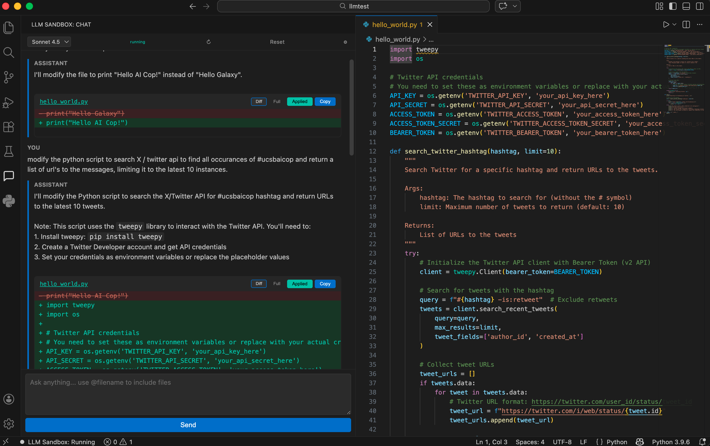

# LLM Sandbox — VS Code Extension

A Cline-style AI coding assistant for VS Code that connects to the UCSB LLM Sandbox Bot API. Features a sidebar chat interface with file awareness, inline diffs, model switching, and configurable context management.

This project also serves as a **reference implementation** for building tools on top of the LLM Sandbox Bot API. If you're here to understand how the API works and what to watch out for, start with the [Working with the LLM Sandbox Bot API](#working-with-the-ucsb-llm-sandbox-bot-api) section below.



---

## Working with the UCSB LLM Sandbox Bot API

### What It Is (and Isn't)

LLM Sandbox is a **privacy-by-design** deployment of LLMs via AWS Bedrock, built for NIST 800-171 compliance. It gives you access to Claude, Amazon Nova, and other Bedrock models without data leaving UCSB's controlled environment.

**It is not** a drop-in replacement for the Anthropic API, OpenAI API, or any standard cloud LLM workflow. The architecture is fundamentally different and imposes constraints you need to design around.

### The Two Big Differences

**1. The API is stateless — the model has no memory**

Unlike the Anthropic or OpenAI APIs where you send a `messages[]` array and the API handles context, the LLM Sandbox Bot API sends one message at a time to the model. The model sees only what you put in that single message.

What this means for you:
- There is no conversation history on the server side
- If you want multi-turn conversation, YOU must maintain a history and prepend it to every message
- The chat UI in LLM Sandbox handles this via DynamoDB — it reconstructs context from stored messages before each call. It is not using Anthropic's native conversation management.
- If you're building your own bot/tool, you need to implement this yourself

The pattern:
```
Your message to the API = prior context you assembled + the actual new message
```

Store the original user input in your history, not the full context-stuffed payload, or your context will compound exponentially.

**2. The API is async — no streaming, no immediate responses**

POST returns a message ID. You poll a GET endpoint until the response shows up as a child of that message.

```
POST /conversation → returns messageId → poll GET /conversation/{id} → find reply in messageMap
```

There are no webhooks, no streaming, no server-sent events. Plan your UX around a loading spinner, not a typing indicator.

### Token Cost Is the Real Constraint, Not Context Window Size

This is the most important thing to understand. With a standard API (Anthropic, OpenAI), prompt caching means repeated context is heavily discounted — cached tokens cost up to 90% less. The LLM Sandbox has **no prompt caching**. Every token is full price, every turn.

Because context is prepended to every message, token consumption grows quadratically:

- Turn 1: send 500 tokens → 500 input tokens consumed
- Turn 5: send ~2,500 context + 500 new → 3,000 input tokens for that one turn
- Turn 10: send ~5,000 context + 500 new → 5,500 for that one turn
- Turn 20: send ~10,000 context + 500 new → 10,500 for that one turn

Cumulative input tokens over 20 turns: **~100,000+**

Once you hit your context budget cap (say 20k tokens), every subsequent turn costs ~20k input tokens regardless. A 50-turn conversation after hitting the cap burns 30 turns x 20k = **600,000 input tokens** just for the second half — and that's with a modest 20k budget, not the 200k or 1M context windows some models support.

Even a seemingly small conversation becomes expensive fast. **Keep conversations short and reset often.** This is not a platform for marathon coding sessions with a single thread.

### Practical Payload Limits

Beyond token cost, there are hard infrastructure limits:

- **AWS API Gateway** — 10MB payload limit, 29-second default timeout
- **DynamoDB items** — 400KB per item. The messageMap returned by GET grows with every turn.
- **Lambda** (if behind the gateway) — 6MB synchronous payload limit

Long conversations will eventually hit these walls even before you run out of context budget. The GET endpoint returning the full messageMap for a 100-turn conversation with large code blocks can approach these limits.

### Context Compression Strategies

Since context is your responsibility, you need a strategy for when conversations grow. Three approaches:

**Keep recent turns only** — Simple, free, but early context is gone forever. Best for quick Q&A.

**Summarize older turns** — Ask the LLM to compress older turns into a prose summary. Good retention, but costs an extra API call each time and the summary itself degrades through repeated compression cycles.

**Extract key facts** — Instead of prose, extract structured facts (files discussed, decisions made, bugs found, outstanding tasks). Facts survive repeated compression better than prose. Best for longer working sessions.

All three are implemented in this extension's `server.py` if you want reference code.

### When to Use LLM Sandbox

- Working with ITAR, CUI, FERPA, or other controlled data that can't go to commercial cloud APIs
- Need privacy guarantees — data stays within UCSB's AWS environment
- Building tools for research workflows with compliance requirements
- Want central LLM access without individual API billing

### When NOT to Use LLM Sandbox

- You need streaming responses (not supported)
- You need the standard Anthropic/OpenAI messages API (not compatible)
- You're building something that depends on native conversation management or tool use
- You need low-latency, high-throughput production workloads
- Your data has no compliance requirements and a commercial API would be simpler

### Quick API Reference

**Auth:** `x-api-key` header

**Send:** `POST {API_URL}/conversation`

**Poll:** `GET {API_URL}/conversation/{conversation_id}` → `messageMap[server_message_id].children[0]` is your reply

**Thread messages:** Use the server-returned `messageId` (a ULID, not your UUID) as `parent_message_id` in your next call.

**Switch models:** Just change the `model` string in the payload. Context is client-managed, so there's no session to rebuild.

**Available models:** Claude (claude-v4.5-sonnet, claude-v4-sonnet, claude-v3.5-sonnet), Amazon Nova, and other AWS Bedrock models available in the sandbox.

---

## Extension Features

- **Sidebar chat panel** with markdown rendering and code blocks
- **File references** — use `@filename` to include file contents in your message
- **Active file context** — automatically sends the currently open file to the model
- **Inline diffs** — proposed file changes shown as diffs with Apply/Copy buttons
- **Model switcher** — change models mid-conversation from the toolbar
- **Context management** — all three compression strategies described above, configurable per-user
- **Configurable settings** — context budget, polling, system prompt, reasoning mode, and more
- **Cross-platform** — works on macOS, Linux, and Windows

## Architecture

```
VS Code Extension (TypeScript webview)
    |
    v
FastAPI local server (Python bridge, auto-managed)
    |
    v
UCSB LLM Sandbox Bot API (Bedrock)
```

The extension automatically manages the Python server — creates a virtual environment, installs dependencies, and starts/stops the server as needed.

## Prerequisites

1. **VS Code** 1.110.0 or newer
2. **Python 3.8+** with `venv` module available
   - **macOS**: `brew install python3`
   - **Windows**: Download from [python.org](https://www.python.org/downloads/) or `winget install Python.Python.3.12`
   - **Linux**: Usually pre-installed. If not: `sudo apt install python3 python3-venv` (Debian/Ubuntu) or `sudo dnf install python3` (Fedora)
3. **UCSB LLM Sandbox Bot API credentials** — you need an API URL and API Key

## Installation

### From VSIX (recommended)

Download the `.vsix` file from the [Releases](../../releases) page, then either:

```bash
code --install-extension llmsandbox-extension-0.1.0.vsix
```

Or in VS Code: Extensions sidebar > `...` menu > "Install from VSIX..."

### From source

See [BUILDING.md](BUILDING.md) for full build instructions. Quick version:

```bash
git clone https://github.com/bhill00/llmsandbox-extension.git
cd llmsandbox-extension
npm install
npm run compile
npx @vscode/vsce package --allow-missing-repository
code --install-extension llmsandbox-extension-0.1.0.vsix
```

## Getting Started

1. Open VS Code and click the **LLM Sandbox** icon in the activity bar (left sidebar)
2. Enter your **API URL** and **API Key** in the setup banner, then click **Save & Start**
   - Or open settings (`Ctrl+,` / `Cmd+,`) and search for "LLM Sandbox"
3. The server will start automatically — you'll see the status change to "running" in the toolbar
4. Start chatting!

## Settings

All settings are under `llmsandbox.*` in VS Code settings.

- `apiUrl` — Bedrock API URL
- `apiKey` — Bedrock API Key
- `serverPort` (default: 8765) — Local server port
- `defaultModel` (default: claude-v4.5-sonnet) — Default model
- `pythonPath` (default: python3) — Path to Python 3 executable
- `contextBudget` (default: 20000) — Context budget in estimated tokens
- `contextStrategy` (default: summary) — Compression strategy: recent, summary, or key-facts
- `recentTurnsToKeep` (default: 6) — Number of recent turns kept verbatim
- `enableReasoning` (default: false) — Enable extended thinking/reasoning
- `autoIncludeActiveFile` (default: true) — Auto-include the open file as context
- `systemPrompt` (default: built-in) — Custom system prompt override
- `pollInterval` (default: 2) — Seconds between polling attempts
- `pollTimeout` (default: 30) — Max seconds to wait for a response

Changing settings requires a server restart. Click the restart button in the chat toolbar or run the "LLM Sandbox: Restart Server" command.

## Commands

- **LLM Sandbox: Reset Conversation** — clear history and start fresh
- **LLM Sandbox: Switch Model** — pick a different model
- **LLM Sandbox: Start/Stop/Restart Server** — manage the local Python server

## Troubleshooting

- **Server won't start**: Check the Output panel (View > Output > "LLM Sandbox Server") for error details
- **Python not found**: Set `llmsandbox.pythonPath` to the full path of your Python 3 executable
- **Timeout errors**: Increase `llmsandbox.pollTimeout` in settings
- **Port conflict**: Change `llmsandbox.serverPort` to a different port

## License

MIT
